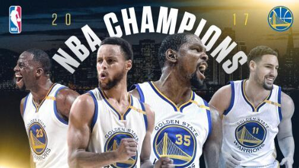
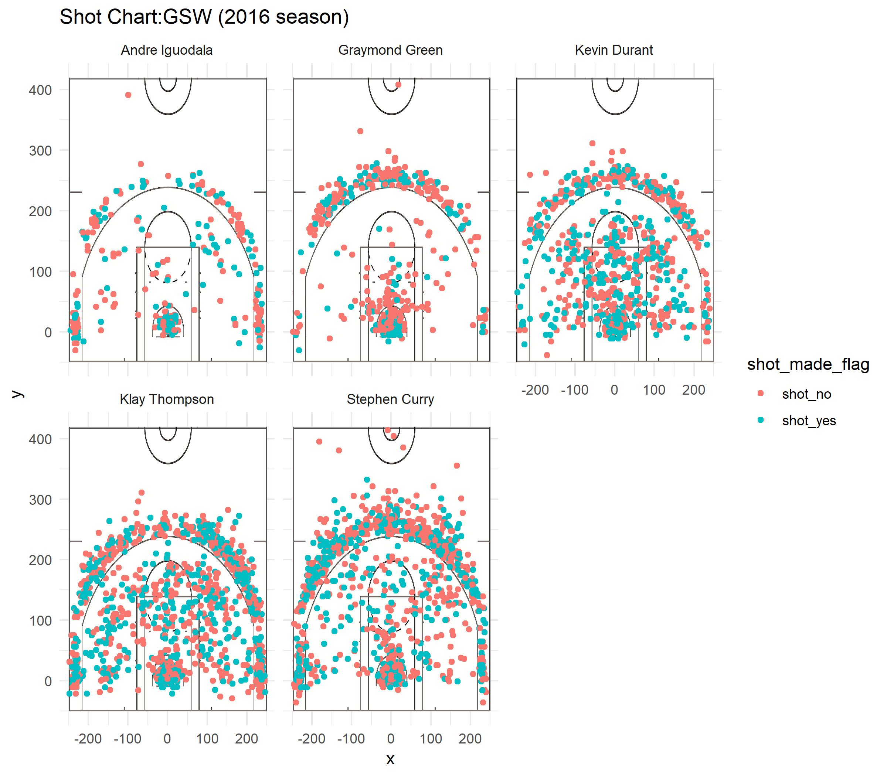

# How excellent was the performance of GSW players in terms of shooting?

In 2016, Golden State warriors swept through the entire league in an unstoppable way. They kept  showing incredible things, breaking records and earning titles, until finally made their way to the NBA champion with a 4-1 total victory against the familiar opponent Cleveland Cavaliers.

```{r out.width="80%", echo=FALSE, fig.align='center'}

```

To make it more specific about the dominance they held over the other 29 teams, let's take a look of some of figures on GSW in 2016-2017 season(the data is from www.basketball-referrence.com):

* **PTS/G**: 115.9, 1st in 30 teams.
* **SRS**: 11.35, 1st in 30 teams.
* **Off Rtg**: 115.6, 1st in 30 teams.
* **Def Rtg**:104.0, 2nd in 30teams.
* **Epected W-L**: 67-15 , 1st in 30 teams.

It can also be indicated by a fact that none of their last 3 rounds lasted more than 5 games.

* Won NBA Finals (4-1) versus Cleveland Cavaliers  (Series Stats)
* Won NBA Western Conference Finals (4-0) versus San Antonio Spurs  (Series Stats)
* Won NBA Western Conference Semifinals (4-0) versus Utah Jazz  (Series Stats)

With a bunch of top players in the league, the GSW proved itself to be the NO.1 team with almost no doubt. In fact, after the ending of the 2016-2017 season, there even existed comments that the GSW in 2016 had been the most outstanding team ever in the history of the National Basketball Association and that is highly possible to be the truth. So why might this be? One way to see it is to analyze the performance of the top 5 players in GSW in terms of shooting.

##Raw Data Description 
The raw data we get is 5 .csv files containing information of every shot for the 5 players: Stephen Curry, Kevin Durant, Andre Iguodala, Graymond Green. The data tables record the variables as below:

* **team_name**
    + character
    + the name of the team
    + "Golden state Warriors"  
* **game_date**
    + character,
    + the date of the game,
    + "12/15/16"
* **season**
    + interger,
    + the year of the season
    + "2016"
* **period**
    + interger
    + an NBA game is divided in 4 periods of 12 mins each and it is the index of the part
    + 4
* **minutes_remaining**
    + interger
    + the minutes of left time when the point is gotten
    + 3
* **seconds_remaining**
    + interger
    + the seconds of left time when the point is gotten
    + 51
* **shot_made_flag**
    + character
    + indicates whether a shot was made (y) or missed (n).
    + "y"
* **action_type**
    + character
    + indicates the type of shooting 
    + "Cutting Layup Shot"
* **shot_type**
    + character
    + the type of the shot
    + "2PT Field Goal""
* **shot_distance**
    + integer
    + distance to the basket (measured in feet).
    + 2
* **opponent**
    + character
    + distance to the basket (measured in feet).
    + 2    
* **x**
    + integer
    + the court coordinates (measured in inches) where a shot occurred .
    + -124
* **y**
    + integer
    + the court coordinates (measured in inches) where a shot occurred .
    + 267

##Data Preparation 
In this part, we add 2 columns (name and minutes) to the existing tabular data, and change the value of column of shot_made-flag into a more readable form. Using the modified data, we create a data frame object shots_data to integrate the 5 data tables, which is then written into a file named "shots-data.csv". Also, we export the summaries of shot information of each player as well as shot_data into 6 txt files.

##Effective Shooting Percentage
In order to show the overall efficiency of the 5 players, we can create a effective shooting percentage table recording the 3 variables: the total shot made, the effective shot, and the proportion of effective shot. Also, to distinguish different types of shot , there are 3 tables respectively showing the data of 2PT, 3PT and shots of all types.

###Overall Effective Shooting Percentage
Using the code below, we can get the effective shooting percentage table in general.

```{r include=FALSE}
library(dplyr)
library(knitr)
```

```{r}

data2 = read.csv("../data/shots-data.csv", stringsAsFactors = F)

effeciency = summarise(group_by(data2,name), total = length(shot_type), made = length(shot_type[shot_made_flag == "shot_yes"]))
effeciency = effeciency %>% mutate(perc_made = made / total) %>% arrange(desc(perc_made))
kable(effeciency, caption = "Overall Effective Shooting Percentage", align = "c")

```

The table above indicated that Kevin Durant had a distinctive percentage of shooting (54.10%) compared with both his teammates and the league average which was 45.7% (the figure is from www.basketball-referrence.com). Also, all the other 4 top players except Graymond Green, had percentage higher than the league average value, with the ratio of 51.75%, 47.13% and 46.72% (Iguodala, Thompson and Curry respectively). It is a direct evidence of its excellence compared with other teams in the league.

###2PT Effective Shooting Percentage
Using the code below, we can get the effective shooting percentage table of 2PT.
```{r}

data2 = read.csv("../data/shots-data.csv", stringsAsFactors = F)

effeciency_2point = summarise(group_by(data2,name), total_2point = length(shot_type[shot_type == "2PT Field Goal"]), made_2point = length(shot_type[shot_type == "2PT Field Goal" & shot_made_flag == "shot_yes"]))
effeciency_2point = effeciency_2point %>% mutate(perc_made_2point = made_2point / total_2point) %>% arrange(desc(perc_made_2point))

kable(effeciency_2point, caption = "2PT Effective Shooting Percentage", align = "c")

```

As we observe from the table, Andre Iguodala had the highest percentage of effective shooting with the amazing figure 63.80%, though the total attempts he made is comparatively few due to his focus on the defence end. The percentage of Kevin Durant ranked the second with 60.65%, followed by Stephen Curry(53.99%), Klay Thompson(51.41%) and Graymond Green(49.21%). 
In terms of the total number of made 2PT goals, Durant is the most productive 2PT shooters in GSW, with 390 made goals. Also quipped with a percentage of shooting more than 60%, Durant is absolutely the best 2PT shooter in the team.

###3PT Effective Shooting Percentage
Using the code below, we can get the effective shooting percentage table of 3PT.

```{r}

data2 = read.csv("../data/shots-data.csv", stringsAsFactors = F)

effeciency_3point = summarise(group_by(data2,name), total_3point = length(shot_type[shot_type == "3PT Field Goal"]), made_3point = length(shot_type[shot_type == "3PT Field Goal" & shot_made_flag == "shot_yes"]))
effeciency_3point = effeciency_3point %>% mutate(perc_made_3point = made_3point / total_3point) %>% arrange(desc(perc_made_3point))

kable(effeciency_3point, caption = "3PT Effective Shooting Percentage", align = "c")
```

It is commonly acknowledged idea that the 3PT goal is the sharp weapon of the Golden State Warrior. The 2 players with the highest percentage of 3PT goals are Klay Thompson and Stephen Curry. Known as the splash brothers, they have a marvelous talent of shooting from places far from the basket. In 2016 season, Thompson had a incredibly high percentage of effective goals of 42.43%, and Curry, with a rate 0.02 lower than Thompson, also had its percentage higher than 40%, which normally is the standard for the historic 3PT shooter. Together, the two made 526 3PT goals in a season, and that was 1578 points earned by them using long shot. The other 3 players, Kevin Durant, Andre Iguodala and Graymond Green also have comparatively high accuracy with percentage of 38.60%, 36.02%, 31.89% respectively.


##Shot Charts
Using function in the ggplot2 package, we can get a nicely illustrated shot chart as below.

```{r out.width="80%", echo=FALSE, fig.align='center'}

```

As it is shown on the graph, Iguodala and Green had far less times of attempting shooting, representing that their major roles is the defender of the team and tended to leave the chance of shooting to the more effective scorers. Also, a weakness of Green can be clearly seen in the graph that he is considerably incapable when he is near the 3-second-zone. In the shot chart of Durant, we can see the distribution of his made shooting was quite typical, with more 2PT. What's incredible is that his chance of success at almost any point of the court is higher compared with the average. Thompson and Curry's charts were quite similar, both had dense attempting points and high percentage of effective goals outside the 3PT line, indicating their capacity as 3PT shooters.

##Conclusion
The Golden State warriors has 2 incredible 3PT shooters, Stephen Curry and Klay thompson, a all-around universal shooter with high percentage of field goal, Kevin Durant and 2 defending players with enough shooting capacity and they made GSW the greatest in 2016.